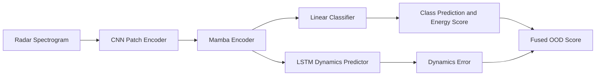
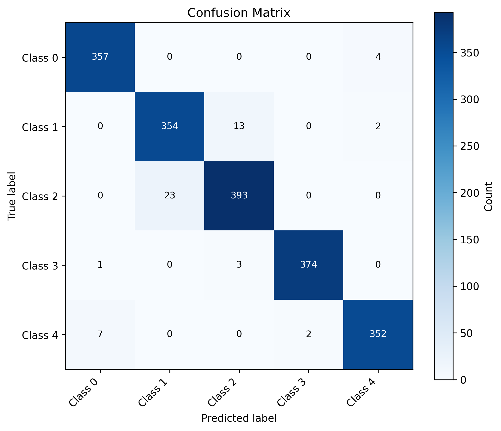
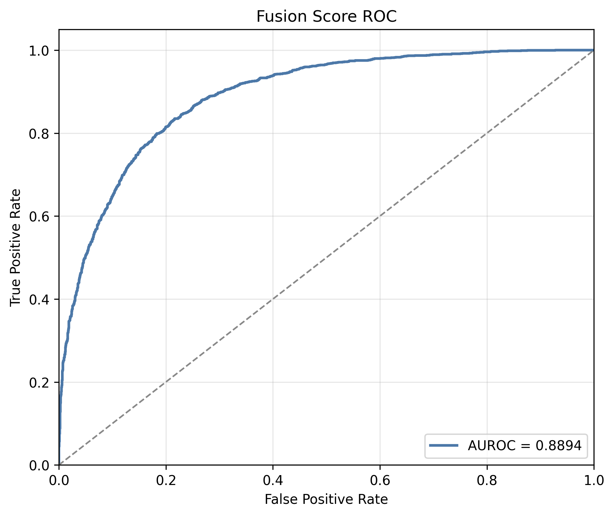

# Radar Human Activity Recognition and OOD Detection with Mamba-JEM

This project uses radar spectrograms for Human Activity Recognition (HAR) and Out-of-Distribution (OOD) detection. It supports the **DIAT-RadHAR** and **UoG-20** datasets and combines convolutional patch encoding, Mamba sequence modeling, JEM energy scores, and LSTM-based latent dynamics prediction.

> This repository contains research-oriented experimental code. Run the commands below from the project root.

## Method Overview



The training objective is:

```text
total_loss = classification_loss + lambda_dyn * dynamics_loss
```

Three scores are used for OOD detection:

- **Energy score:** `-logsumexp(logits)`;
- **Dynamics error:** mean squared error between the LSTM-predicted next latent state and the actual latent state;
- **Fusion score:** an equally weighted combination of the two scores after normalization using the ID test distribution.

## Repository Structure

```text
MA_code/
├── main.py                         # General window-level training and evaluation
├── main_diat.py                    # DIAT window-level experiment
├── main_uog.py                     # UoG window training and grouped evaluation
├── main_uog_sl.py                  # UoG sample-level training and evaluation
├── model/
│   ├── fusion_dowm_patch.py        # Patch encoders for DIAT and UoG
│   ├── mamba.py                    # Mamba encoder
│   ├── mamba_basic.py              # Basic Mamba block
│   ├── JEM.py                      # Classifier, energy score, and dynamics branch
│   └── LSTM_predictor.py           # LSTM dynamics predictor
├── datasets_processing/
│   ├── datasets_processed_diat_ood.py
│   ├── data_prepared_Uog_ood.py
│   └── data_prepared_Uog_ood_version_sl.py
├── datasets/                       # Processed HDF5 datasets
├── utils/eval_plots.py             # Classification and OOD visualizations
├── checkpoints/                    # Model checkpoints created during training
└── results/                        # Evaluation plots
```

## Installation

Python 3.9 or newer is recommended.

```bash
python -m venv .venv
source .venv/bin/activate
python -m pip install --upgrade pip
pip install torch numpy h5py matplotlib scikit-learn scipy pillow
```

For CUDA acceleration, install the PyTorch build that matches your local CUDA version.

## Data Format

The repository currently includes the following processed datasets:

| File | Purpose | Shape of one `spectrograms` sample | Group field |
| --- | --- | --- | --- |
| `datasets/diat_processed_ood_StonepeltingGrenadesthrowing.h5` | DIAT leave-one-class-out OOD | `(3, 128, 128)` | `source_ids` |
| `datasets/uog20_subject_ood.h5` | UoG subject OOD | `(43, 128)` | `subject_ids` |
| `datasets/uog20_subject_ood_sl.h5` | UoG sample-level/grouped evaluation | `(43, 128)` | `sample_ids` |

Each HDF5 file should contain four splits:

```text
train/
val/
test_id/
test_ood/
```

Each split must contain at least `spectrograms` and `labels`. Labels may be class indices or one-hot vectors. Grouped experiments additionally require `sample_ids`, `source_ids`, or `subject_ids`.

## Quick Start

### 1. DIAT Experiment

```bash
python main_diat.py \
  --dataset diat \
  --h5_path datasets/diat_processed_ood_StonepeltingGrenadesthrowing.h5 \
  --num_classes 5 \
  --epochs 100 \
  --batch_size 32 \
  --save_path checkpoints/best_model_diat.pt \
  --plot_dir results/diat
```

This dataset treats “Stone pelting-Grenades throwing” as the OOD class and uses the remaining five classes for ID classification.

### 2. UoG Window-Level Training and Grouped Evaluation

```bash
python main_uog.py \
  --dataset uog \
  --h5_path datasets/uog20_subject_ood_sl.h5 \
  --num_classes 6 \
  --epochs 100 \
  --batch_size 32 \
  --save_path checkpoints/best_model_uog_window.pt \
  --plot_dir results/uog_wl
```

The model is trained on individual windows. Evaluation reports window-level accuracy and AUROC, then aggregates windows by `sample_ids` to calculate sample-level metrics.

### 3. UoG Sample-Level Training and Evaluation

```bash
python main_uog_sl.py \
  --dataset uog \
  --h5_path datasets/uog20_subject_ood_sl.h5 \
  --num_classes 6 \
  --epochs 100 \
  --batch_size 4 \
  --save_path checkpoints/best_model_uog_sample.pt \
  --plot_dir results/uog_sl
```

This entry point groups all windows sharing the same `sample_id` into one sample. Window logits, energy scores, and dynamics errors are averaged for sample-level training and evaluation.

## Evaluating an Existing Model

Use the same model arguments as during training, point to the saved checkpoint, and enable `test_only`:

```bash
python main_diat.py \
  --dataset diat \
  --h5_path datasets/diat_processed_ood_StonepeltingGrenadesthrowing.h5 \
  --num_classes 5 \
  --save_path checkpoints/best_model_diat.pt \
  --plot_dir results/diat \
  --test_only True
```

The boolean argument in `main.py`, `main_diat.py`, and `main_uog.py` uses `type=bool`. Therefore, explicitly pass only `--test_only True`; omit the argument when it is not needed. `main_uog_sl.py` accepts either `--test_only true` or `--test_only false`.

## Preprocessing the Raw Data

### DIAT-RadHAR

The raw dataset directory should contain one directory for each of the six names in `DIAT_CLASSES`, with `figure*.jpg` files inside. The following command holds out class 5 as OOD:

```bash
python datasets_processing/datasets_processed_diat_ood.py \
  --input_dir datasets/diat/DIAT-RadHAR \
  --output_h5 datasets/diat_processed.h5 \
  --window_size 128 \
  --stride 64 \
  --holdout_class 5
```

The script resizes each image to `(3, 128, 256)`, creates `(3, 128, 128)` windows along the time axis, and generates an OOD filename containing the held-out class name.

### UoG-20

The input directory must contain:

- `Spectrograms.mat`, with the `Doppler2_MM` and `files` keys;
- `Label.mat`, with the `UpdatedLabel` key.

Generate the recommended dataset with `sample_ids`:

```bash
python datasets_processing/data_prepared_Uog_ood_version_sl.py \
  --input_dir datasets/Uog20/Dataset_848 \
  --output_h5 datasets/uog20_subject_ood_sl.h5 \
  --frame_length 128 \
  --stride 64 \
  --num_classes 6 \
  --test_ood_subjects 12 \
  --seed 42
```

If only subject-level grouping is needed, use:

```bash
python datasets_processing/data_prepared_Uog_ood.py \
  --input_dir datasets/Uog20/Dataset_848 \
  --output_h5 datasets/uog20_subject_ood.h5
```

UoG preprocessing reserves the last subjects for OOD evaluation. Samples belonging to the remaining subjects are split by class into train, validation, and ID test sets.

## Common Arguments

| Argument | Default | Description |
| --- | ---: | --- |
| `--epochs` | `100` | Number of training epochs |
| `--batch_size` | `32` | Window-level batch size; defaults to `4` for sample-level training |
| `--lr` | `1e-4` | AdamW learning rate |
| `--weight_decay` | `1e-4` | Weight decay |
| `--embed_dim` | `128` | Hidden dimension used by the patch and Mamba encoders |
| `--mamba_layers` | `2` | Number of Mamba blocks |
| `--dropout` | `0.1` | Dropout probability |
| `--lambda_dyn` | `0.1` | Weight of the dynamics loss |
| `--num_workers` | `14` | Number of DataLoader workers for window-level scripts |
| `--normalize_uint8` | Disabled | Divide `uint8` input by 255; unnecessary for the existing float datasets |

If the machine has few CPU cores, DataLoader startup fails, or the code is run in a notebook, add `--num_workers 0`.

## Outputs

Training saves the checkpoint with the highest validation accuracy. Evaluation reports and generates:

- ID classification loss and accuracy;
- statistics for the Energy, Dynamics, and Fusion OOD scores;
- AUROC for all three OOD scores;
- confusion and normalized confusion matrices, a classification report, and per-class accuracy;
- OOD ROC curves and ID/OOD score distributions.

Example results:

<p align="center">
  
  
</p>

## Notes

- The training entry points currently select CUDA automatically but do not detect Apple MPS. They fall back to CPU when CUDA is unavailable.
- Model input dimensions are fixed: `(3, 128, 128)` for DIAT and `(43, 128)` for UoG. The patch encoder must also be updated if the preprocessing dimensions are changed.
- `--test_only` still loads the train, validation, ID test, and OOD test splits, so evaluation files must retain the complete HDF5 structure.
- To reproduce an experiment, record the data split, checkpoint arguments, and held-out OOD class or subjects because these choices directly affect AUROC.
